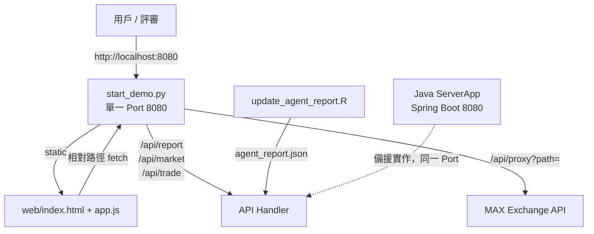

# 專案基準規格書 (Baseline Spec) — AI 投資委員會

**版本**：Baseline v1.0（架構凍結）
**專案**：2026 雲湧智生：臺灣生成式 AI 應用黑客松競賽 / MaiCoin 命題
**核心主題**：AI Investment Committee — AI 不只理解市場，更理解你
**System Integrator**：Team Leader
**基準來源**：實際程式碼掃描（非僅依架構紀錄文件推測）

## 1. 文件定位

本文件為架構凍結基準線。任何後續變更若與第 8 章「開發紅線」衝突，一律駁回；若與第 6 章「歧異裁定」衝突，以本文件為準。

## 2. 系統組件現況盤點

| 層級 | 檔案 | 實測現況 |
|---|---|---|
| 啟動／整合 | `start_demo.py` | Python `http.server` + `socketserver.TCPServer`，綁定 **127.0.0.1:8080**，`daemon` 執行緒常駐，`Ctrl+C` 平滑關閉 |
| 靜態資源 | 同上 | `SimpleHTTPRequestHandler(directory="web")`，前端與 API **同源同埠** |
| CORS 代理 | `handle_proxy()` | `/api/proxy?path=...`，剝除 `path` 後轉發至 `https://max-api.maicoin.com`，timeout 5s |
| 後端服務 | `src/main/java/api/ServerApp.java` | Spring Boot 3.2.5 / Java 17，`@RestController`，提供 `/test`、`/api/report`、`/api/market`、`/api/trade` |
| 技術分析 | `RealMarketAgent.java` | RSI、MA5、MA20、MACD |
| 風控 | `RiskAgent.java` | MDD 最大回撤、波動率 |
| API 封裝 | `MaxApiManager.java` | MAX Public/Private 請求封裝 |
| 檔案 I/O | `FileHandler.java` | `java.nio.file` JSON 持久化 |
| 數據分析 | `scripts/update_agent_report.R` | httr / jsonlite / TTR，CSV 特徵萃取與投資人格分級 |
| 前端 | `web/index.html` | 5 大分頁，**唯一 script 標籤為 `<script src="app.js" defer>`** |
| 前端邏輯 | `web/app.js` | 原生 SVG K 線、十字游標、輪詢、Data Normalization |
| 資料集 | `data/MaiCoin_最近一年份出入金及交易紀錄.csv` | 官方一年份出入金與交易紀錄 |

## 3. 高階架構與資料流



關鍵性質：前端所有 `fetch()` 皆為相對路徑（`/api/report`、`/api/trade`、`/api/proxy?...`、`agent_report.json`），不存在任何跨來源請求，CORS 在架構層即被消滅。

## 4. API 契約

**GET /api/report** → 回傳 `currentPrice`、`change24h`、`debates[4]`（`agent`／`role`／`avatar`／`score`／`signal`／`text`）、`committee`（`buyPercentage`／`holdPercentage`／`sellPercentage`／`finalDecision`／`confidenceScore`）、`timestamp`。Java 版額外回傳 `rawReport`。

**GET /api/market?market=soltwd** → `{ price, change24h, volume }`

**POST /api/trade** → 請求 `{ market, side, volume }`；回應 `{ status:"201 Created", success, orderId:"MAX_ORD_<epoch_ms>", market, side, price, volume, totalTWD, executedAt, message }`

**GET /api/proxy?path=/api/v2/...** → 白名單式轉發至 MAX，其餘 query 原樣帶入

**GET /test** → 健康檢查

## 5. 低階設計要點

前端圖表（全部原生 SVG + Vanilla JS）：
- `fetchMaxKlineData()`：`/api/proxy?path=/api/v2/k&market=&limit=35&period=`，週期可切換 1／5／15 分、1／4 時、日、週
- 十字游標：`mousemove`／`touchmove` 反算 X 座標定位 K 棒索引；Y 軸**磁吸該根 K 棒收盤價**，非跟隨滑鼠
- OHLC Tooltip：選中 K 棒即時渲染開高低收量並套漲跌色
- 盤口：`/api/proxy?path=/api/v2/depth&limit=10`，前端取 6 檔，`asks.reverse()` 還原專業盤口排序，依累積量比例繪深度條
- 輪詢：`homePollingInterval`／`chartPollingInterval` 5 秒一次，切換視圖時 `clearInterval` 防記憶體洩漏
- `fetchData()`：三段降級 — `/api/report` → `agent_report.json` → `mockData`，並深拷貝 `mockData` 做 Data Normalization，將 `debates[]` 映射回四位 Agent 欄位，避免 `undefined` 崩潰

委員會加權模型（R 端）：
```
committee_score = technical*0.4 + sentiment*0.2 + risk*0.2 + behavior*0.2
personality: 交易筆數 >=3000 高頻型 / >=1000 短線型 / >=300 波段型 / else 保守型
risk_score:  保守 30 / 波段 60 / 短線 80 / 高頻 90
signal:      RSI>70 SELL / RSI<30 BUY / else HOLD
```

## 6. 實作與文檔歧異裁定

| # | 文檔說法 | 實測 | 裁定 |
|---|---|---|---|
| 1 | `app.js` 使用 Chart.js | `index.html` 僅有 `<script src="app.js" defer>`，無任何 CDN／框架引用 | **原生 SVG 為準**（紅線 2） |
| 2 | `server_launcher.py` 提供 `/api/proxy` | 該檔不存在，Proxy 實作在 `start_demo.py` | **`start_demo.py` 為唯一入口與 Proxy 承載者**（紅線 1） |
| 3 | `start_demo.py` 啟動 Java Spring Boot | **實測未啟動 Java**；`start_demo.py` 自身以純 Python 承載全部 `/api/*` | **Python 為 Demo 執行時基準；Java `ServerApp` 為同契約備援實作，二者不得同時佔用 8080** |

第 3 點是本次掃描的新發現，架構紀錄描述與實作不符，已在此定調。

## 7. 已知風險與技術債

R 管線（`update_agent_report.R`）原本實質無法成功執行，`start_demo.py` 以 `try/except` 吞掉錯誤並印出 `NOTICE`，因此失敗被靜默。以下為各項技術債的現況追蹤：

| # | 區塊 | 項目 | 狀態 | 備註 |
|---|---|---|---|---|
| 1 | R 管線 | `setwd("C:/Users/User/Desktop/Hackathon")` 硬編碼個人路徑，覆蓋 `cwd=base_dir` | **已修復**（改用 `commandArgs` 推導 `PROJECT_ROOT`） | 未經 R 執行驗證 |
| 2 | R 管線 | `write_json(agent_report, ...)` 在 `agent_report` 被定義**之前**呼叫 → object not found | **已修復**（該區塊已刪除） | 未經 R 執行驗證 |
| 3 | R 管線 | `risk_agent_score`、`behavior_agent_score` 從未定義即用於 `committee_score` | **已修復**（`risk = 100 - risk_score`；`behavior = 移動平均成本法已實現勝率 × 100`） | 未經 R 執行驗證 |
| 4 | R 管線 | 輸出路徑與讀取路徑不一致（寫 `output/`，讀 `web/`） | **已修復**（統一為 `web/agent_report.json`，全檔已無 `output/`） | 未經 R 執行驗證 |
| 5 | R 管線 | `read.csv()` 未指定 encoding（紅線 3 適用範圍） | **已修復**（補 `fileEncoding="UTF-8"`） | 經查證該 CSV 為純 ASCII 無中文，此項實為預防性措施而非現存缺陷 |
| 6 | R 管線 | 明文硬編碼 CoinMarketCap API Key | **已修復**（改為 `.env` + `readRenviron` + `Sys.getenv("CMC_API_KEY")`，空值 fail-fast；金鑰已由後台撤換重發） | 舊金鑰仍存在於 git commit 歷史，經決議暫不改寫歷史以免影響全隊分支，風險已由撤換金鑰消除 |
| 7 | 其他 | `subprocess.run(..., text=True)` 未帶 `encoding='utf-8'`，擷取 R 中文輸出會亂碼（紅線 3 缺口） | **已修復**（補 `encoding` 與 `errors='replace'`，timeout 10→60 秒，檢查 `returncode` 並在失敗時輸出 stdout/stderr 後繼續降級，例外收斂為 `FileNotFoundError` 與 `TimeoutExpired`） | 已實際執行驗證，`FileNotFoundError` 分支確認生效 |
| 8 | 其他 | `fetch_max_ticker()` 例外時回傳固定假價 `2411.2`，Java 端回退 `5200.0`／`2100000.0` | **未修復**（第二階段） | 須確保 Demo 時不落入 fallback |
| 9 | 其他 | `/api/report` 的 RSI、投票比例含 `random`，非真實推導 | **未修復**（第二階段） | — |
| 10 | 其他 | `/api/trade` 為模擬撮合，未接真實簽章下單 | **未修復**（第二階段） | — |
| 11 | 其他 | TCP 伺服器綁定 `0.0.0.0` 且 API 無認證 | **已修復**（改綁 `127.0.0.1`，僅本機可存取；Port 維持 8080，不違反紅線 1） | API 端點本身仍無認證機制，僅靠網路層隔離 |

**修復批次名稱**：第一階段技術債與資安修復

- R 管線第 1-5 項因本機未安裝 R（`Rscript` 不在 PATH）而**未經執行時驗證**。需在具備 R 與 `httr`／`jsonlite`／`TTR` 的環境執行 `Rscript scripts/update_agent_report.R`，確認退出碼為 0 且 `web/agent_report.json` 的 `updated_time` 已更新後，才可視為完全結案。
- R 腳本對 CoinMarketCap 與 MAX API 回應仍無錯誤處理：金鑰失效時 `result$data` 為 `NULL`，會導致後續子集操作報錯。此項列入第二階段。

## 8. 開發紅線遵守聲明 (Guardrails Compliance Declaration)

本 AI 開發輔助系統確認已完整理解以下 4 條由 System Integrator 制定的紅線，並在本專案後續**所有**開發任務中絕對遵守，不因任何效能、便利或美觀理由妥協。

**紅線 1：架構凍結與單點啟動**
- 內容：全端部署與 API Proxy 統一由 `start_demo.py` 承載於單一 Port 8080，絕對禁止將前後端拆分為多個 Port。
- 成因：前端曾直接呼叫 `max-api.maicoin.com` 遭瀏覽器 CORS 阻擋，`try/catch` 靜默觸發並載入 102,720.0 等假資料，追查耗時。
- 遵守作法：所有前端請求維持相對路徑；新增外部資料源一律走 `/api/proxy?path=`；不新增任何監聽埠、不引入獨立 dev server、不啟用第二個後端行程。
- 違規判定：出現非 8080 的對外監聽埠；前端出現絕對 URL 或跨來源 `fetch`；出現 `Access-Control-Allow-Origin` 以外的 CORS 繞道手段。

**紅線 2：前端零依賴原則**
- 內容：K 線圖與盤口維持原生 SVG + Vanilla JS，嚴禁引入 React、Vue、Chart.js、D3.js 等任何框架或外掛。
- 成因：已完成自研 SVG 十字游標、磁吸收盤價、OHLC Tooltip 與 6 檔深度條；引入圖表庫會作廢既有互動邏輯並增加載入負擔與離線風險。
- 遵守作法：所有圖表增強以既有 SVG 繪製函式擴充；不新增 `<script src>` 外部來源、不新增 `package.json`／建置步驟、不引入 npm 依賴。
- 違規判定：`web/` 下任何檔案出現 `react`／`vue`／`chart.js`／`d3` 字樣或 CDN script 標籤；`index.html` 的 script 標籤數量超過 1 個且指向非本地資源。

**紅線 3：Windows 編碼防禦**
- 內容：任何操作檔案的 Python 腳本，涉及中文字元時必須強制宣告 `encoding='utf-8'`。
- 成因：Windows 預設 cp950，中文 JSON／CSV／log 讀寫會產生火星文亂碼，且錯誤常在展演現場才浮現。
- 遵守作法：所有文字模式 `open()` 顯式帶 `encoding='utf-8'`；`subprocess.run(..., text=True)` 一併補 `encoding='utf-8'`；JSON 輸出維持 `ensure_ascii=False` 並以 `.encode('utf-8')` 回寫；R 端 `read.csv()` 補 encoding。
- 違規判定：存在文字模式 `open()` 未帶 `encoding`；存在 `text=True` 的 subprocess 未帶 `encoding`；輸出檔案以 cp950 落地。

**紅線 4：大模型限流防護**
- 內容：呼叫 Amazon Bedrock 必須遵守 1 RPS，嚴禁多 Agent 併發請求，必須序列化／排隊執行。
- 成因：Bedrock 配額為每秒 1 請求，4 位 Agent 若並行呼叫必然觸發 ThrottlingException，導致辯論流程中斷。
- 遵守作法：所有 Bedrock 呼叫收斂至單一佇列閘道，逐一同步執行，相鄰呼叫間隔 ≥ 1 秒並含指數退避重試；禁止 `ThreadPoolExecutor`、`asyncio.gather`、`CompletableFuture.allOf` 等併發原語套用於 Bedrock 路徑；4 Agent 採循序輪替而非扇出。
- 違規判定：Bedrock 呼叫路徑同時在途請求數 > 1；相鄰兩次呼叫間隔 < 1 秒；呼叫被包在任何併發／執行緒池結構中。

## 9. 可執行正確性性質 (Correctness Properties)

| ID | 對應紅線 | 性質 | 驗證方式 |
|---|---|---|---|
| P1 | 1 | 專案內對外 HTTP 監聽埠集合恆等於 `{8080}` | 靜態掃描 port 常數 + 啟動後 `netstat` 比對 |
| P2 | 1 | 前端所有網路請求的 URL 皆為相對路徑 | 掃描 `app.js` 全部 `fetch()` 引數 |
| P3 | 2 | `web/**` 不含 `react`／`vue`／`chart.js`／`d3` 任何引用 | grep 全文；CI 失敗即阻擋 |
| P4 | 2 | `index.html` 的 `<script src>` 僅指向同目錄本地檔案 | HTML 解析斷言 |
| P5 | 3 | 所有 `.py` 文字模式 `open()` 與 `text=True` subprocess 均帶 `encoding='utf-8'` | AST 掃描 |
| P6 | 3 | 中文字串經寫入再讀回後恆等（round-trip 不變性） | Property-based test，隨機中文字串 |
| P7 | 4 | Bedrock 閘道的並行度上限恆等於 1 | 注入計數器，斷言 max in-flight == 1 |
| P8 | 4 | 任意兩次相鄰 Bedrock 呼叫時間差 ≥ 1000ms | 時序記錄 property test |
| P9 | 6 | `/api/report` 回應中 `buy+hold+sell == 100` | 契約測試 |
| P10 | 7 | Demo 執行時價格不等於任何 fallback 常數 | 端到端斷言，防假資料上台 |
